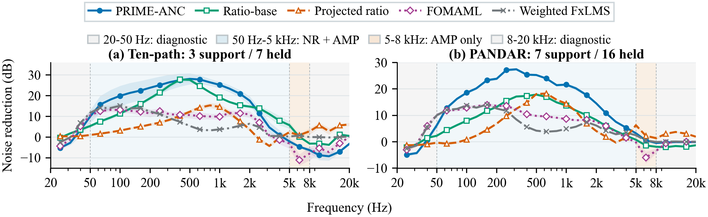

# PRIME-ANC

Code for **PRIME-ANC: Path-Ratio-Informed Modeling for Efficient Neural Filter Synthesis in Active Noise Control**.

PRIME-ANC combines an analytic path-ratio magnitude base with a learned bounded correction. Given calibrated primary and secondary paths, the shared network produces a causal FIR through minimum-phase reconstruction and truncation. Optional Gauss–Newton refinement updates the FIR taps.

## Results at a glance

The standard model with paired support-path interpolation achieves the following held-out noise reduction over 50 Hz–5 kHz (mean ± sample SD across ten splits):

| Dataset | Support / held-out | Noise reduction (dB) |
|---|---:|---:|
| Ten-path | 3 / 7 paths | 18.81 ± 2.57 |
| PANDAR | 7 / 16 participants | 17.76 ± 0.30 |



## Installation

Python 3.10 or newer is required.

```bash
python -m venv .venv
source .venv/bin/activate
pip install -e '.[test,adaptive,plots]'
python -m pytest tests -q
```

For fused NVIDIA GPU refinement, use Linux, CUDA-enabled PyTorch and a compatible Triton installation. CPU synthesis and scoring do not require Triton.

## Pretrained models and data

The [v0.1.0 release assets](https://github.com/HANA225-HUB/PRIME-ANC/releases/tag/v0.1.0) contain 60 standard-model checkpoints, calibrated paths, frozen FIRs and evaluation audio. Download `prime_anc_paper_assets_20260916.tar.gz`, then:

```bash
mkdir -p assets
tar -xzf prime_anc_paper_assets_20260916.tar.gz -C assets
python scripts/verify_assets.py --assets assets
```

The checkpoint layout records the dataset, split and seed. Each checkpoint contains network tensors only. See [asset layout and provenance](docs/DATA_ASSETS.md) and [data attribution](docs/RIGHTS.md).

## Synthesize filters

```bash
python scripts/synthesize.py \
  --paths assets/data/tenpath/model_inputs_estimated/pphat_sphat_all10.npz \
  --checkpoint assets/models/tenpath/split_01/seed_20260830/model.pt \
  --dataset tenpath --output example_firs.npy
```

For your own calibrated paths, supply an NPZ with `p` and `s` arrays shaped `[queries, taps]` at 48 kHz. The output is a `[queries, 2048]` FIR bank. Use `--device cuda` for GPU inference. The generator uses estimated paths; evaluation ground-truth paths are separate inputs to the scorer.

## Evaluation and figures

Replay the two white-noise-trained adaptive references using the frozen ten-noise evaluation and held-participant folds:

```bash
python scripts/replay_adaptive_table.py --assets assets --output adaptive_table.json
```

Expected NR / AMP / control RMS:

| Method | NR (dB) | AMP (dB) | RMS |
|---|---:|---:|---:|
| FxLMS | 19.497 | 0.125 | 0.150 |
| FxNLMS | 19.833 | 0.148 | 0.152 |

Rebuild the frequency and refinement plots from the supplied numerical results:

```bash
python scripts/plot_random10.py
python scripts/plot_refinement_quality_time.py
```

`scripts/evaluate.py` scores arbitrary frozen FIR banks; run it with `--help` for the input schema. The [experiment protocol](docs/PROTOCOL.md) specifies windows, normalization, aggregation and timing. Figure 2 and the adaptive table use different adaptation protocols.

## Code layout

| Directory | Purpose |
|---|---|
| `prime_anc/` | Model, calibrated-path features, FIR synthesis, calibration estimator, differentiable training objective and scorer |
| `prime_anc/baselines/` | Weighted FxLMS/FxNLMS kernels and CPU direct WMMSE |
| `prime_anc/refinement/` | GN refinement and optional fused GPU PCG |
| `scripts/` | Inference, evaluation, adaptive table replay, plotting and asset checks |
| `configs/` | Dataset and scoring settings |
| `results/paper/` | Numerical figure/table inputs and fixed dataset splits |
| `tests/` | Numerical checks for the released implementations |

The release supports pretrained inference, frozen-FIR evaluation and figure reconstruction. It also provides the training objective and output-structure control models for method development. Dataset augmentation, full training orchestration and retraining of the related neural baselines are not included; the bundled numerical results for those comparisons are provided for plotting.

## Citation

Author and software metadata are in [CITATION.cff](CITATION.cff). Please also credit the original acoustic-path and noise datasets listed in [data attribution](docs/RIGHTS.md).

## License

The source code is released under the [MIT License](LICENSE). Acoustic-path data and audio retain their original dataset licenses; see [data attribution](docs/RIGHTS.md).
